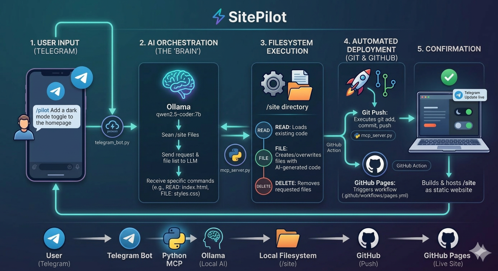

# SitePilot (MCP-Powered Website Operations)

SitePilot is a Telegram-controlled, AI-assisted static website maintenance system.
You send a request from Telegram, and the project uses an MCP-style operation loop to read/edit files in `site/`, then deploy changes through Git.

## What this project does

- Accepts website change requests from Telegram (`/pilot ...`)
- Uses a local LLM (via Ollama) to generate structured file operations
- Executes file operations inside the `site/` folder
- Auto-commits and pushes updates for deployment (for example, GitHub Pages)
- Optionally sends Telegram deployment notifications

## MCP role in this project

The file `mcp_server.py` is the core operation engine.

It works like an MCP-style controller by:

- receiving a user task
- exposing available project files to the model
- asking the model to return explicit commands only
- parsing and executing those commands deterministically

### Supported operation commands

The model is instructed to return only these operations:

- `READ: <filename>` - read a file from `site/`
- `FILE: <filename>` + content block - create/update a file in `site/`
- `DELETE: <filename>` - delete a file from `site/`

This command-contract is the project's MCP-like interface between AI planning and actual file execution.

## Architecture

- `telegram_bot.py`
  Telegram bot entrypoint and command handlers (`/start`, `/pilot`, `/status`).
- `mcp_server.py`
  MCP-style operation server: model prompt, command parsing, filesystem operations, Git deploy, and notifications.
- `site/`
  The actual website files that the AI edits.
- `requirements.txt`
  Python dependencies.

## End-to-end workflow

1. User sends `/pilot <change request>` in Telegram.
2. Bot launches:
   ```bash
   python mcp_server.py "<change request>"
   ```
3. `mcp_server.py` gathers current `site/` structure.
4. Ollama model returns operation commands (`READ`, `FILE`, `DELETE`).
5. Server executes commands against `site/`.
6. Server runs Git deploy steps (`add`, `commit`, `push`).
7. Optional Telegram notification is sent.

## Workflow Diagram



## Prerequisites

- Python 3.12+
- [Ollama](https://ollama.com/) installed locally
- Ollama model available locally: `qwen2.5-coder:7b`
- Telegram bot token from [@BotFather](https://t.me/botfather)
- Git remote configured (if you want automatic push/deploy)

## Installation

```bash
git clone <your-repo-url>
cd MCP
pip install -r requirements.txt
```

## Environment variables

Create a `.env` file in the project root:

```env
TELEGRAM_TOKEN=your_bot_token_here
TELEGRAM_NOTIFY_IDS=your_chat_id
```

- `TELEGRAM_TOKEN`: required for bot + notifications
- `TELEGRAM_NOTIFY_IDS`: optional comma-separated chat IDs to notify after deploy

## Run the bot

```bash
python telegram_bot.py
```

Then in Telegram:

- `/start` - usage help
- `/status` - health check
- `/pilot Add a dark mode toggle to the homepage`

## Direct MCP operation run (without Telegram)

You can run the MCP server directly:

```bash
python mcp_server.py "Update hero section text and CTA button"
```


## Demo

Video: https://youtu.be/wWsGnYfuECk
